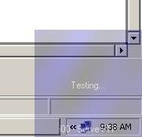



## Transparencies in windows 98/me

### Description

I have seen many ways to do this using that evil ocx (not open source); but this is pure vb!!!! I origionaly posted this on VBForums and decided that I should post it on PSC so here it is. ONLY works on 98 and ME. Please vote and leave feedback.
 
### More Info
 

             |
---                |---
**Submitted On**   |2002-05-28 09:34:00
**By**             |[Kris Bennett \(i00 Productions\)](https://github.com/Planet-Source-Code/PSCIndex/blob/master/ByAuthor/kris-bennett-i00-productions.md)
**Level**          |Intermediate
**User Rating**    |5.0 (10 globes from 2 users)
**Compatibility**  |VB 4\.0 \(32\-bit\), VB 5\.0, VB 6\.0
**Category**       |[Miscellaneous](https://github.com/Planet-Source-Code/PSCIndex/blob/master/ByCategory/miscellaneous__1-1.md)
**World**          |[Visual Basic](https://github.com/Planet-Source-Code/PSCIndex/blob/master/ByWorld/visual-basic.md)
**Archive File**   |[Transparen874575272002\.zip](https://github.com/Planet-Source-Code/kris-bennett-i00-productions-transparencies-in-windows-98-me__1-35167/archive/master.zip)

